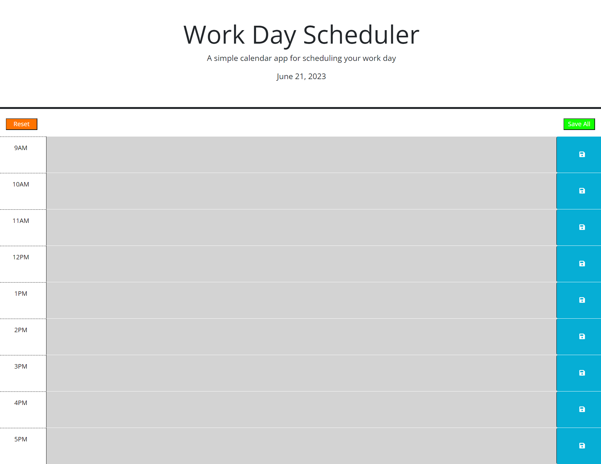

# 05 Third-Party APIs: Work Day Scheduler

## Scheduler

This application allows information to be entered for a block of time and stored locally, so that the information doesn't disappear if you leave the webpage.

When the page loads, the current date will be displayed above, and 9 rows (or time blocks) will appear below. The first is 9 AM, 10 AM, and so on. It goes all the way to 5 PM.

After entering information in any of the time blocks, the user can press the Save button next to that time block to save the information locally. 

Additionally, there is a Clear button on the left side, to clear everything, and a Save All button on the right side, to save everything in case the user wants to fill out several time blocks without having to save after each block. 

This app will be powered by jQuery, using the Day.js library for date and time.

## Mock Up

## Link

Repo: https://github.com/Coridane/scheduler
Website: https://coridane.github.io/scheduler